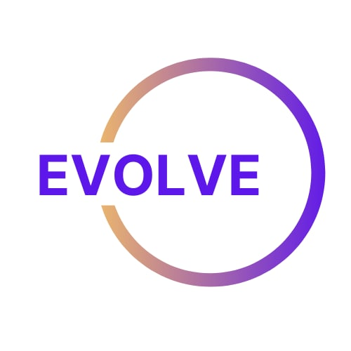

# EVOLVE
Web3athon Project

## <a href="https://react-landing-page-template-2021.vercel.app/"> LIVE DEMO</a>


Built-in feature from Next.js:

- ☕ Minify HTML & CSS
- 💨 Live reload
- ✅ Cache busting


#### 1. Clone repo

```
clone the repo
cd react-landing-page-template-2021
yarn
yarn run start
```


